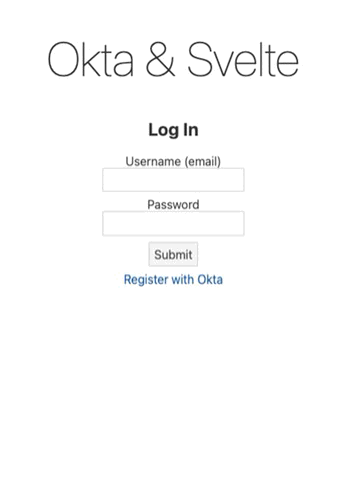

# Svelte & Okta

This example app uses the [Okta IDX Module](https://github.com/okta/okta-auth-js/blob/master/docs/idx.md) to demonstrate embedded user registration and authentication flows between a Svelte single-page app and Okta.

The flows use Okta's [Interaction Code grant type](https://developer.okta.com/docs/concepts/interaction-code/#the-interaction-code-flow), built on the PKCE protocol of OAuth2, to allow for public client trust without the need for a client secret or an API key.

## Prerequisites

An Okta OIE-enabled tenant must be available (all tenants created March 1, 2022 or later are OIE by default). [Sign up for free here](https://developer.okta.com/signup/). The free tenant will allow you to run this app.

### Okta org requirements & assumptions:

- password as only factor (must remove Security Question)
- uses default authn server (default authn server is a free feature)
- Profile Enrollment for the app created allows for user self-enrollment without email verification
- the default Authz server must have an access policy for interaction code

The above are not requirements for using the IDX module with embedded flows; rather, they are requirements for running this specific example. Passwordless experiences, factor enrollments, user factor verification, etc. are all possible when using Okta OIE and the IDX Module.

## Getting started

### Configure Okta

1. Create a new app with the following:
    - *sign-in method:* OIDC - OpenID Connect
    - *type:* Single-Page Application
    - *grant type:* 
        - Authorization Code 
        - Interaction Code
    - *assignments:* Allow everyone in your organization to access
    - *Sign-in redirect URIs:* `http://localhost:8080`
    - *Trusted Origins:* `http://localhost:8080`
2. Security > Profile Enrollment > Add a profile enrollment policy
    - uncheck *Required before access is granted* for email verification
    - ensure *Sign-up is Allowed* for new users
    - in *Manage Apps* add the app created in step (1)
3. Security > API > Add New rule (optionally in a new policy)
    - *If Grant type is*:
        - Authorization Code
        - Interaction Code
    - *And User* is any user assigned the app
    - *And Scopes* requested are any scopes
    - **move rule to Priority 1, or otherwise ensure rule evaluation**
4. Security > Authenticators
    - delete the *Security Question* authenticator

### Download & run the app

1. git clone `https://github.com/cconcannon/svelte-okta`
2. `cd svelte-okta && npm install`
3. update `src/oktaAuth.js` with your Okta tenant domain and app Client ID
4. `npm run dev`

## Troubleshooting

#### If you can't log in...

1. ensure the user exists in Okta
2. Check that you added `http://localhost:8080` to trusted origins when creating the app (Security > API > Trusted Origins)
3. double-check the redirect URI and client ID

#### If you can't register...

1. check that you created a profile enrollment policy that allows sign-up *without email validation*
2. check that the profile enrollment policy is assigned to your app